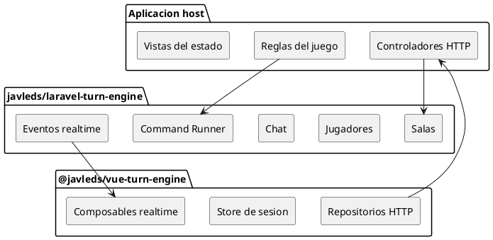

# Laravel Game Engine

Paquete backend reusable para juegos de mesa en linea por turnos usando Laravel.

Este paquete contiene el motor generico del servidor: salas, jugadores, lobby, chat, estado persistido, ejecucion de comandos, historial de eventos y eventos realtime. No contiene reglas de un juego especifico. La aplicacion host aporta la definicion del juego, setup, politicas, handlers de comandos y vistas de estado para cada jugador.

La documentacion principal en ingles esta en [README.md](README.md).

## Enlaces de Repositorio

Repositorios oficiales:

- Paquete backend Laravel: https://github.com/javleds/laravel-game-engine
- Paquete frontend Vue: https://github.com/javleds/vue-game-engine

## Relacion Backend / Frontend

`javleds/laravel-turn-engine` es la mitad backend del motor. `@javleds/vue-turn-engine` es la mitad frontend. El backend mantiene el estado autoritativo y publica eventos realtime; el frontend consume endpoints HTTP, guarda la sesion local del jugador y escucha cambios por canal de sala.



## Que Resuelve

El paquete backend resuelve:

- Crear, unir, salir, reconectar, desconectar e iniciar salas.
- Autenticacion por token de jugador dentro de una sala.
- Modelos Eloquent del motor para salas, jugadores, estados, eventos y chat.
- Servicios genericos de chat y eventos broadcast.
- Registro y ejecucion transaccional de comandos.
- Contratos para definicion de juego, setup, politicas y vistas.
- Migraciones y service provider de Laravel.

La aplicacion host sigue siendo responsable de:

- Reglas del juego y handlers de acciones.
- Estado inicial del juego.
- Limites de jugadores y reglas para iniciar partida.
- Proyeccion publica/privada del estado.
- Controladores o rutas HTTP.
- UI y repositorios de acciones especificas del juego.

## Instalacion Local

Para desarrollo con repos hermanos:

```json
{
  "repositories": [
    {
      "type": "path",
      "url": "../laravel-game-engine",
      "options": {
        "symlink": true
      }
    }
  ],
  "require": {
    "javleds/laravel-turn-engine": "dev-main"
  }
}
```

Despues:

```bash
composer update javleds/laravel-turn-engine --with-dependencies
php artisan migrate
```

Cuando el paquete este publicado en Packagist, se podra reemplazar el path repository por una version semantica.

## Configuracion en Laravel

El provider se descubre automaticamente por Composer. La app host debe registrar una o mas implementaciones de `GameDefinition` en `GameRegistry`.

```php
use App\Games\MyGame\MyGameDefinition;
use TurnEngine\Laravel\GameRegistry;

$this->app->singleton(GameRegistry::class, function (): GameRegistry {
    return new GameRegistry([
        $this->app->make(MyGameDefinition::class),
    ]);
});
```

Si hay mas de un juego registrado, configura el juego por defecto:

```php
return [
    'default_game' => 'my-game',
];
```

## Contratos Principales

- `GameDefinition`: identifica el juego y conecta politicas, setup, comandos y vistas.
- `GamePolicy`: valida limites y ciclo de vida de la sala.
- `GameSetupHandler`: crea el estado inicial.
- `GameViewFactory`: crea vistas publicas/privadas del estado.
- `CommandHandler`: aplica una transicion especifica de dominio.

La direccion de dependencia debe ser siempre aplicacion host -> contratos del engine. El engine no debe depender de clases del juego.

## Checklist Para Publicar

- Revisar la licencia MIT y cambiarla si se requiere otro modelo de distribucion.
- Crear tag semantico, por ejemplo `v0.1.0`.
- Agregar CI para checks PHP y prueba de instalacion.

## Checks de Calidad

Ejecuta la validacion de metadata antes de publicar:

```bash
composer validate --strict
```
