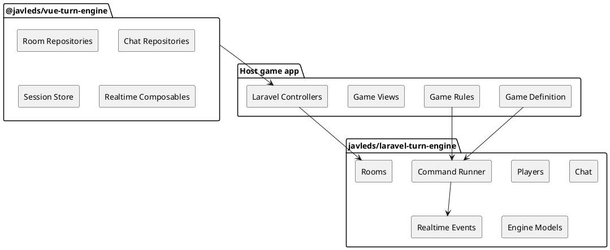

# Laravel Game Engine

Reusable Laravel backend package for online turn-based board games.

This package owns the generic server-side engine: rooms, players, lobby lifecycle, chat, persisted game state, command execution, event history, and realtime broadcast events. It does not contain rules for a specific board game. A host application provides the game definition, setup handler, policy, command handlers, and player-facing view factory.

Spanish documentation is available in [README.es.md](README.es.md).

## Repository Links

Official repositories:

- Laravel backend package: https://github.com/javleds/laravel-game-engine
- Vue frontend package: https://github.com/javleds/vue-game-engine

## Package Pair

This package is the backend half of the engine. It is designed to be used with the Vue client package, `@javleds/vue-turn-engine`, but the HTTP and realtime contracts can also be consumed by another frontend.



## Responsibilities

The engine package provides:

- Room creation, joining, leaving, reconnect, disconnect, and start flows.
- Player token authentication for room-scoped actions.
- Engine-owned Eloquent models for rooms, players, states, events, and chat messages.
- Generic chat services and realtime broadcast events.
- A command registry and command runner for game-specific actions.
- Contracts for game definitions, setup, policy checks, and state views.
- Package migrations and Laravel service provider auto-discovery.

The host game provides:

- Game rules and command handlers.
- Initial setup logic and deterministic state seed handling.
- Room policy limits such as player count and start requirements.
- Public/private game state view shaping.
- HTTP controllers or routes that expose the engine services.
- Frontend UI and game-specific action repositories.

## Installation

For local development with a sibling checkout:

```json
{
  "repositories": [
    {
      "type": "path",
      "url": "../laravel-game-engine",
      "options": {
        "symlink": true
      }
    }
  ],
  "require": {
    "javleds/laravel-turn-engine": "dev-main"
  }
}
```

Then run:

```bash
composer update javleds/laravel-turn-engine --with-dependencies
php artisan migrate
```

For Packagist usage, replace the path repository with the official package version once the repository is published.

## Laravel Setup

The service provider is auto-discovered through Composer:

```json
{
  "extra": {
    "laravel": {
      "providers": [
        "TurnEngine\Laravel\TurnEngineServiceProvider"
      ]
    }
  }
}
```

Publish config only if the host app wants a local config file:

```bash
php artisan vendor:publish --tag=turn-engine-config
```

The host application must register at least one `GameDefinition` in `TurnEngine\Laravel\GameRegistry`.

```php
use App\Games\MyGame\MyGameDefinition;
use TurnEngine\Laravel\GameRegistry;

$this->app->singleton(GameRegistry::class, function (): GameRegistry {
    return new GameRegistry([
        $this->app->make(MyGameDefinition::class),
    ]);
});
```

If more than one game is registered, configure the default game key:

```php
return [
    'default_game' => 'my-game',
];
```

## Core Contracts

A game adapter implements these contracts:

- `GameDefinition`: stable game key, ruleset version, policy, setup handler, command registry, and view factory.
- `GamePolicy`: room size and lifecycle checks.
- `GameSetupHandler`: initial state creation when a room starts.
- `GameViewFactory`: public/private state projection for API responses.
- `CommandHandler`: game-specific state transition for a command payload.

The dependency direction is always host game -> engine contracts. The engine does not depend on host game classes.

## Backend / Frontend Contract

The Vue package expects the host app to expose compatible HTTP endpoints for room, chat, and game state flows. The current engine services are transport-agnostic enough to sit behind Laravel controllers, API resources, or another HTTP layer.

Realtime events use room channels and these event names:

- `.room.state.changed`
- `.room.chat.message.created`

The frontend package must be configured with the host realtime client, usually Laravel Echo.

## Publishing Checklist

Before publishing this package publicly:

- Review the MIT license and update it if a different distribution model is required.
- Tag a semantic version, for example `v0.1.0`.
- Add CI for PHP syntax, static checks, and package install smoke tests.

## Current Status

This package is extracted and usable as a local Composer path package. It is not tied to the Giants game domain.

## Quality Checks

Run package metadata validation before publishing:

```bash
composer validate --strict
```
